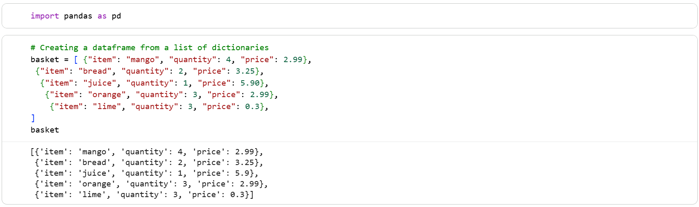
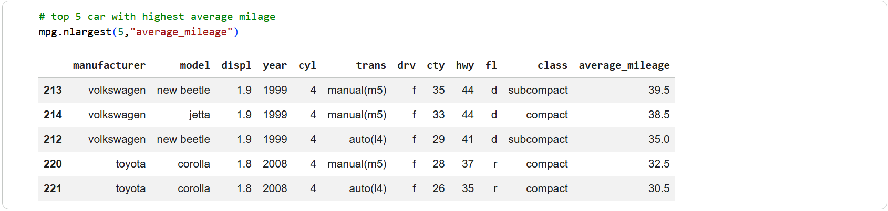
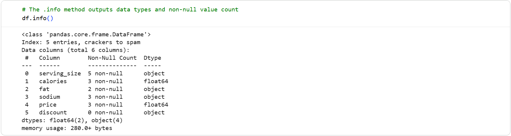

# Python Programming & Data Analysis Project

This project was completed as part of a **Data Technician Bootcamp** and focuses on learning the fundamentals of Python programming and introductory data analysis using **Pandas** within Google Colab notebooks.

The exercises demonstrate how Python can be used to build logical programs, perform calculations, interact with users, and analyse structured datasets. These foundational programming and data analysis skills are essential for data analytics, automation, and building more advanced data-driven applications.

---

# Project Overview

This project includes a collection of Python exercises designed to introduce key programming concepts such as variables, conditional logic, loops, and user interaction. 

In addition to Python fundamentals, the project also introduces **data analysis using the Pandas library**, where datasets are loaded, explored, and analysed to extract useful insights.

The notebooks demonstrate how programming logic and data analysis tools can work together to solve real-world problems.

---

# Python Skills Demonstrated

This project demonstrates several core Python programming concepts including:

- Creating and using **variables**
- Displaying output using the `print()` function
- Collecting user input using the `input()` function
- Performing **type casting** using `int()`
- Writing **if statements** for decision making
- Using **for loops** and **while loops**
- Performing **arithmetic calculations**
- Building simple **interactive programs**

---

# Pandas Data Analysis Skills

The project also introduces **data analysis using the Pandas library**, which is widely used in data science and analytics.

Pandas was used to:

- Import and work with datasets
- Create and manipulate **DataFrames**
- Explore dataset structure using `.info()`
- Perform simple analysis on datasets
- Identify patterns and key insights within data

---

# Example Python Programs

## User Input and Greeting Program

This program asks the user for their name and age using the `input()` function and prints a personalised greeting message using `print()`.

---

## Number Manipulation and Type Casting

This program asks the user to enter a four-digit number and performs calculations to rearrange the digits.

This demonstrates:
- Type casting
- Integer arithmetic
- Logical problem solving

---

## Nested Loop Pattern

This program uses nested `for` loops to generate a number pattern. Loops allow repeated execution of code and are commonly used when processing datasets or performing repeated tasks.

---

## Loop-Based Calculation

This program calculates the sum of numbers from **1 to a user-defined value** using a `for` loop.

---

# Pandas Examples

## Creating a DataFrame

This example demonstrates creating a **Pandas DataFrame from a list of dictionaries**, showing how structured data can be organised and prepared for analysis.

---

## Dataset Analysis

This example analyses a dataset to identify the **top five vehicles with the highest average mileage**, demonstrating how Pandas can be used for filtering and ranking data.

---

## Exploring Data with `.info()`

The `.info()` method provides an overview of the dataset structure, including column names, data types, and missing values. This is an important step in **data exploration and data cleaning**.

---

# Tools Used

- **Python**
- **Pandas**
- **Google Colab**
- **Jupyter Notebooks**

---

## Repository Structure

My-Python-Projects

├── Data_Technician_Workbook_Week_6_2026.docx  
│  
├── Python_Day_1_Exercises_Grant_Riches.ipynb  
├── Python_Day_2_Exercises_Grant_Riches.ipynb  
│  
├── PandasDataFrames_01_Grant_Riches.ipynb  
├── PandasDataFrames_02_Grant_Riches.ipynb  
├── Pandas_DataFrames_03_Grant_Riches.ipynb  
│  
├── user-input-greeting.png  
├── digit-reversal.png  
├── nested-loops-pattern.png  
├── sum-loop.png  
│  
├── pandas-dataframe.png  
├── pandas-analysis.png  
├── pandas-info.png  
│  
└── README.md  

---

## Google Colab Notebooks

The notebooks used in this project were developed using **Google Colab**, which allows Python code to be executed and shared in an interactive environment.

---

## Learning Outcomes

Through this project I developed skills in:

- Writing Python programs using loops and conditional logic
- Building interactive programs using user input
- Performing calculations and logical operations
- Working with datasets using **Pandas**
- Exploring and analysing structured data
- Using Google Colab notebooks for Python development
