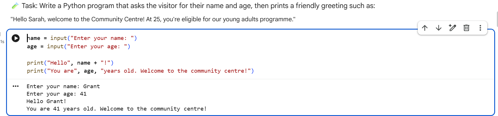
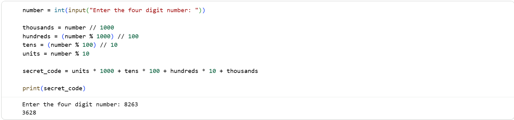
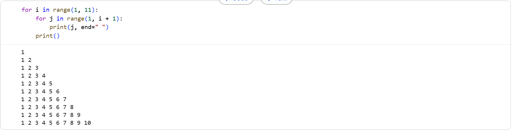
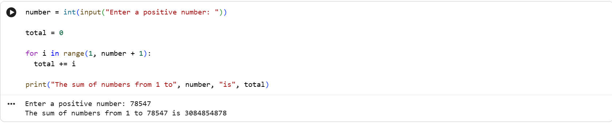

# Python Programming Fundamentals Project

This project was completed as part of a **Data Technician Bootcamp** and focuses on learning the fundamentals of Python programming using **Google Colab notebooks**.

The exercises demonstrate how Python can be used to build logical programs, perform calculations, and interact with users through input and output. These foundational programming skills are essential for data analysis, automation, and building more advanced applications.

---

## Project Overview

The project consists of several Python programming exercises designed to introduce key programming concepts such as variables, conditional logic, loops, and user interaction. Programs collect user input, apply calculations, and display results using clear output messages.

Examples include interactive greeting programs, number manipulation tasks, loop-based patterns, and calculations using user-provided values.

---

## Python Skills Demonstrated

This project demonstrates several core Python programming concepts:

- Creating and using **variables**
- Displaying output using the `print()` function
- Collecting user input using the `input()` function
- Performing **type casting** using `int()` to convert input into numbers
- Writing **if statements** for logical decision making
- Using **for loops** and **while loops** to repeat tasks
- Performing **calculations and arithmetic operations**
- Building programs that **interact with users**

---

## Example Programs

### User Input and Greeting Program



This program asks the user for their name and age using the `input()` function. The program then prints a personalised greeting message using `print()`.  
This demonstrates **user interaction and string output formatting**.

---

### Number Manipulation and Type Casting



This program asks the user to enter a four-digit number. The input is converted to an integer using `int()` and mathematical operations are used to extract and rearrange the digits.

This demonstrates:
- **Type casting**
- **integer arithmetic**
- **logical problem solving**

---

### Nested Loops Example



This program uses **nested `for` loops** to generate a number pattern. Loops allow repeated execution of code and are commonly used for iterating through sequences or datasets.

This demonstrates:
- **for loops**
- **nested loops**
- controlling output formatting.

---

### Loop-Based Calculation



This program asks the user for a number and calculates the sum of numbers from **1 to the entered value** using a `for` loop.

This demonstrates:
- **loop iteration**
- **incremental calculations**
- working with **user input and arithmetic operations**

---

## Tools Used

- **Python**
- **Google Colab**
- **Jupyter Notebooks**

---

## Repository Structure

```
My-Python-Projects
│
├── Data_Technician_Workbook_Week_6_2026.docx
├── python-notebook.ipynb
├── user-input-greeting.png
├── digit-reversal.png
├── nested-loops-pattern.png
├── sum-loop.png
└── README.md
```

---

## Google Colab Notebook

The full notebook containing the Python exercises can be viewed here:

https://colab.research.google.com/drive/17QuzmT4tsGpZEjtAk4dyH46-EQcFHkKd

---

## Learning Outcomes

Through this project I developed skills in:

- Writing basic Python programs
- Using variables and user input
- Implementing conditional logic and loops
- Performing calculations with Python
- Building simple interactive programs
- Using Google Colab notebooks for Python development
